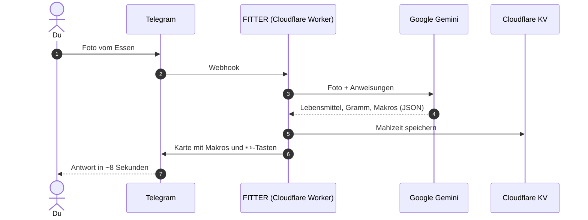

[Русский](README.md) · [English](README.en.md) · [Español](README.es.md) · [Português](README.pt.md) · **Deutsch** · [Français](README.fr.md) · [Italiano](README.it.md) · [Türkçe](README.tr.md) · [Українська](README.uk.md) · [Polski](README.pl.md)

 

&nbsp;&nbsp;

<a href="#-funktionen">Funktionen</a> · <a href="#-so-funktionierts">So funktioniert’s</a> · <a href="#-screenshots">Screenshots</a> · <a href="https://t.me/arkhitkovv">Kontakt</a>

> [!IMPORTANT]
> **FITTER schätzt Kalorien nur ungefähr.** Das Ergebnis eines Fotos hängt von den Zutaten und der Portionsgröße ab, und jeder Eintrag lässt sich von Hand korrigieren. Der Bot ersetzt keine ärztliche oder ernährungsberaterische Beratung.

> [!NOTE]
> Der Bot spricht derzeit Russisch. Diese Seite ist eine Übersetzung der [russischen README](README.md).

---

## 📸 Screenshots

  

---

## ✨ Funktionen

<table>
  <tr>
    <td width="50%" valign="top">

      <h3>📷 Essen erfassen</h3>
      <ul>
        <li>Gerichterkennung per Foto: Lebensmittel, Gramm und Makros pro 100 g</li>
        <li>Die Bildunterschrift dient als Hinweis: „das sind 200 g Reis“</li>
        <li>Erfassen per Text: „2 Eier und Toast gegessen“</li>
        <li>Name oder Gramm ändern, die KI berechnet die Makros neu</li>
        <li>Einträge mit einem Tipp löschen</li>
      </ul>
    
</td>
    <td width="50%" valign="top">

      <h3>🏷️ Verpackte Lebensmittel</h3>
      <ul>
        <li>Foto der Nährwerttabelle: der Bot übernimmt die Werte exakt</li>
        <li>Barcode lesen und in <a href="https://world.openfoodfacts.org">Open Food Facts</a> suchen</li>
        <li>Oder einfach die Ziffern des Barcodes senden</li>
      </ul>
    
</td>
  </tr>
  <tr>
    <td width="50%" valign="top">

      <h3>🎯 Ziele und Fortschritt</h3>
      <ul>
        <li>Fragebogen mit 6 Fragen und Tagesziel nach der Mifflin-St-Jeor-Formel</li>
        <li>Ziele: abnehmen, Gewicht halten oder Muskeln aufbauen</li>
        <li>Tages- und Wochenbilanz: gegessen, übrig, wo es zu viel war</li>
        <li>Gewichtsverlauf mit Diagramm und automatischer Zielanpassung</li>
      </ul>
    
</td>
    <td width="50%" valign="top">

      <h3>💧 Wasser und Tabletten</h3>
      <ul>
        <li>Wasserziel von 30 ml pro kg Körpergewicht, Tasten +250 und +500 ml</li>
        <li>Erinnerungen alle 30 Minuten bis 2 Stunden, nachts Ruhe</li>
        <li>Vitamine und Medikamente nach Einnahmezeit</li>
        <li>Tasten „Genommen“, „In 30 Min“ und „Überspringen“</li>
      </ul>
    
</td>
  </tr>
  <tr>
    <td width="50%" valign="top">

      <h3>🧠 KI-Assistent</h3>
      <ul>
        <li>„Was essen“: 3 Vorschläge passend zu den restlichen Kalorien und Eiweiß</li>
        <li>Jeder Vorschlag landet mit einer Taste im Tagebuch</li>
        <li>Wochenrückblick mit Note, Lob und 3 Tipps</li>
        <li>Antworten auf Ernährungsfragen, die dein Ziel berücksichtigen</li>
      </ul>
    
</td>
    <td width="50%" valign="top">

      <h3>🏆 Gewohnheiten</h3>
      <ul>
        <li>Eine Tagesserie, die du nicht abreißen lassen willst</li>
        <li>13 Erfolge: Serien, Tage im Ziel, Wasser, Etiketten, Gewicht</li>
        <li>Feier-Animationen, wenn du dein Ziel erreichst</li>
      </ul>
    
</td>
  </tr>
  <tr>
    <td width="50%" valign="top">

      <h3>📱 Tagebuch (Mini App)</h3>
      <ul>
        <li>Kalorienring, Wochenkalender und Wochendiagramm, Makrokarten mit Tipps</li>
        <li>Wasserglas mit Welle und ±250-ml-Tasten</li>
        <li>Erfassen per Text, auch für vergangene Tage</li>
        <li>Helles und dunkles Design</li>
      </ul>
    
</td>
    <td width="50%" valign="top">

      <h3>🎨 Design und Zuverlässigkeit</h3>
      <ul>
        <li>Eigenes Iconset, <a href="icons/">FITTER Icons</a></li>
        <li>Automatischer Wechsel auf ein Ersatzmodell von Gemini</li>
        <li>24 s KI-Timeout: klare Antwort statt endlosem Laden</li>
        <li>Ein Tageslimit für Anfragen schützt das kostenlose Kontingent</li>
      </ul>
    
</td>
  </tr>
</table>

---

## 🤖 Befehle

| Befehl | Was er tut |
|:---|:---|
| `/start` | Begrüßung und Fragebogen |
| `/today` · `/week` | Heute und die letzten 7 Tage |
| `/water` · `/remind` | Wasser heute und Erinnerungen |
| `/advice` | Was essen: 3 KI-Vorschläge |
| `/pills` | Tabletten: abhaken, hinzufügen, löschen |
| `/weight 72.5` | Gewicht eintragen |
| `/profile` | Profil und Tagesziel |
| `/awards` · `/analysis` | Erfolge und KI-Wochenrückblick |
| `/app` | Tagebuch öffnen |
| `/reset` · `/help` | Fragebogen neu ausfüllen und Hilfe |
| `/delete` | Alle deine Daten löschen |

---

## 🧠 So funktioniert’s

| Schicht | Technologie | Warum |
|:---|:---|:---|
| Oberfläche | Telegram Bot API + Mini App | Alle haben schon Telegram, nichts herunterzuladen |
| Server | Cloudflare Workers | Kostenlos, rund um die Uhr, keine Server zu pflegen |
| KI | Google Gemini (Flash / Flash-Lite) | Versteht Fotos, antwortet in strengem JSON |
| Datenbank | Cloudflare KV | Kostenlos und in Workers integriert |
| Deployment | GitHub → Cloudflare Builds | Jeder Commit landet von selbst auf dem Server |

Der gesamte Server ist eine einzige Datei, [`worker.js`](worker.js), ohne Abhängigkeiten.

---

## 🔒 Sicherheit und Datenschutz

- Der Webhook akzeptiert nur Anfragen mit dem geheimen Telegram-Header.
- Das Tagebuch prüft die kryptografische Signatur von Telegram: Fremde Daten lassen sich nicht öffnen.
- Schlüssel liegen in den Cloudflare-Secrets, nicht im Code.
- Fotos werden **nicht gespeichert**: Sie gehen nur zur Erkennung an Gemini.

Mehr dazu: [Datenschutzerklärung](https://sailxx.github.io/FITTER-AI/privacy.html) (auf Russisch).

---

## 🗺 Roadmap

- [x] **v1** Bot auf Cloudflare, Fragebogen, Tagesziel, Foto-Erfassung, Tagebuch, Gewicht, Wasser, Etiketten und Barcodes
- [x] **v2** Assistent „Was essen“, Tabletten mit Erinnerungen, Statistiken, helles und dunkles Design
- [x] **v2.6** Neues Tagebuch-Design, Makro-Tipps, Wochendiagramm; Wasser und Tabletten im Bot überarbeitet
- [ ] **v3.0** Produkt: eigenständige App

Vollständiger Verlauf: [CHANGELOG.md](CHANGELOG.md) (auf Russisch).

---

## ❓ Fragen und Ideen

Einen Fehler gefunden oder eine Idee? Öffne ein [Issue](https://github.com/sailxx/FITTER-AI/issues/new) oder schreib dem Autor auf Telegram: [@arkhitkovv](https://t.me/arkhitkovv).

---

## ⚖️ Lizenz

FITTER steht unter der **MIT**-Lizenz, siehe [LICENSE](LICENSE). Das Projekt ist unabhängig und steht in keiner Verbindung zu Telegram, Google oder Cloudflare. Die Namen gehören ihren Inhabern.

   
  
   
  <b>FITTER</b> · Ein Foto. Volle Kontrolle.
   
  Gemacht von <a href="https://t.me/arkhitkovv">Vlad</a>. Wenn dir das Projekt geholfen hat, gib dem Repo einen ⭐

