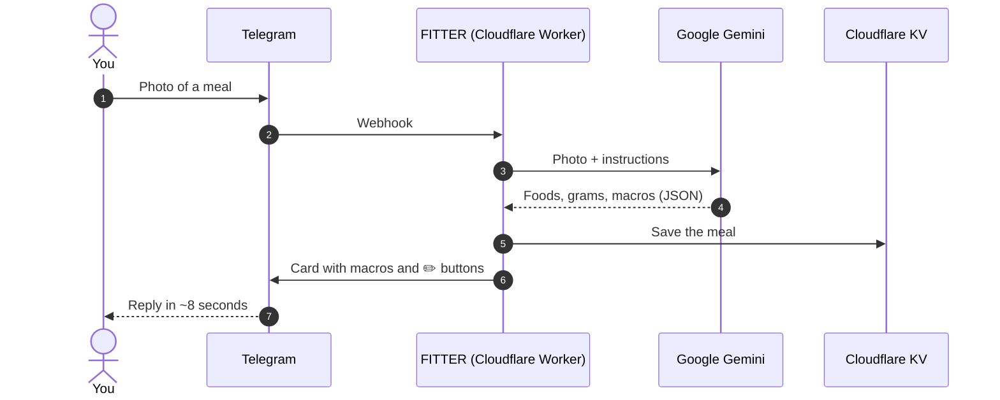

[Русский](README.md) · **English** · [Español](README.es.md) · [Português](README.pt.md) · [Deutsch](README.de.md) · [Français](README.fr.md)

 

&nbsp;&nbsp;

<a href="#-features">Features</a> · <a href="#-how-it-works">How it works</a> · <a href="#-screenshots">Screenshots</a> · <a href="https://t.me/arkhitkovv">Contact</a>

> [!IMPORTANT]
> **FITTER estimates calories approximately.** Photo results depend on the ingredients and portion size, and any entry can be corrected by hand. The bot does not replace advice from a doctor or dietitian.

> [!NOTE]
> The bot currently speaks Russian. This page is a translation of the [Russian README](README.md).

---

## 📸 Screenshots

  

---

## ✨ Features

<table>
  <tr>
    <td width="50%" valign="top">

      <h3>📷 Logging food</h3>
      <ul>
        <li>Dish recognition from a photo: foods, grams and macros per 100 g</li>
        <li>A photo caption works as a hint: “this is 200 g of rice”</li>
        <li>Log by text: “ate 2 eggs and toast”</li>
        <li>Edit the name or grams and the AI recalculates macros</li>
        <li>Delete entries in one tap</li>
      </ul>
    
</td>
    <td width="50%" valign="top">

      <h3>🏷️ Packaged food</h3>
      <ul>
        <li>Photo of a nutrition label: the bot copies the values exactly</li>
        <li>Barcode reading and lookup in <a href="https://world.openfoodfacts.org">Open Food Facts</a></li>
        <li>Or just send the barcode digits</li>
      </ul>
    
</td>
  </tr>
  <tr>
    <td width="50%" valign="top">

      <h3>🎯 Goals and progress</h3>
      <ul>
        <li>A 6-question survey and a daily target by the Mifflin–St Jeor formula</li>
        <li>Goals: lose weight, maintain or gain muscle</li>
        <li>Daily and weekly summaries: eaten, left, where you went over</li>
        <li>Weight tracking with a chart and automatic target updates</li>
      </ul>
    
</td>
    <td width="50%" valign="top">

      <h3>💧 Water and pills</h3>
      <ul>
        <li>Water target of 30 ml per kg of body weight, +250 and +500 ml buttons</li>
        <li>Reminders every 30 minutes to 2 hours, quiet at night</li>
        <li>Vitamins and medicines by time of intake</li>
        <li>“Taken”, “In 30 min” and “Skip” buttons</li>
      </ul>
    
</td>
  </tr>
  <tr>
    <td width="50%" valign="top">

      <h3>🧠 AI assistant</h3>
      <ul>
        <li>“What to eat”: 3 options that fit your remaining calories and protein</li>
        <li>Any option goes into the diary with one button</li>
        <li>Weekly review with a score, praise and 3 tips</li>
        <li>Answers to nutrition questions that take your target into account</li>
      </ul>
    
</td>
    <td width="50%" valign="top">

      <h3>🏆 Habits</h3>
      <ul>
        <li>A daily streak you won’t want to break</li>
        <li>13 achievements: streaks, days on target, water, labels, weight</li>
        <li>Celebration animations when you hit your target</li>
      </ul>
    
</td>
  </tr>
  <tr>
    <td width="50%" valign="top">

      <h3>📱 Diary (Mini App)</h3>
      <ul>
        <li>Calorie ring, week calendar and week chart, macro cards with hints</li>
        <li>Water glass with a wave and ±250 ml buttons</li>
        <li>Log food by text, including past days</li>
        <li>Light and dark theme</li>
      </ul>
    
</td>
    <td width="50%" valign="top">

      <h3>🎨 Design and reliability</h3>
      <ul>
        <li>Its own icon set, <a href="icons/">FITTER Icons</a></li>
        <li>Automatic fallback to a backup Gemini model</li>
        <li>24-second AI timeout: a clear reply instead of endless loading</li>
        <li>A daily request limit protects the free quota</li>
      </ul>
    
</td>
  </tr>
</table>

---

## 🤖 Commands

| Command | What it does |
|:---|:---|
| `/start` | Introduction and survey |
| `/today` · `/week` | Today’s summary and the last 7 days |
| `/water` · `/remind` | Today’s water and reminders |
| `/advice` | What to eat: 3 AI suggestions |
| `/pills` | Pills: mark, add, delete |
| `/weight 72.5` | Log your weight |
| `/profile` | Profile and daily target |
| `/awards` · `/analysis` | Achievements and AI weekly review |
| `/app` | Open the diary |
| `/reset` · `/help` | Retake the survey and help |
| `/delete` | Delete all your data |

---

## 🧠 How it works

| Layer | Technology | Why |
|:---|:---|:---|
| Interface | Telegram Bot API + Mini App | Everyone already has Telegram, nothing to download |
| Server | Cloudflare Workers | Free, 24/7, no servers to manage |
| AI | Google Gemini (Flash / Flash-Lite) | Understands photos, replies in strict JSON |
| Database | Cloudflare KV | Free and built into Workers |
| Deploy | GitHub → Cloudflare Builds | Every commit ships to the server by itself |

The whole server is a single file, [`worker.js`](worker.js), with zero dependencies.

---

## 🔒 Security and privacy

- The webhook only accepts requests with Telegram’s secret header.
- The diary checks Telegram’s cryptographic signature, so nobody can open someone else’s data.
- Keys live in Cloudflare secrets, not in the code.
- Photos are **not stored**: they go to Gemini only for recognition.

More: [privacy policy](https://sailxx.github.io/FITTER-AI/privacy.html) (in Russian).

---

## 🗺 Roadmap

- [x] **v1** Cloudflare bot, survey, target, photo logging, diary, weight, water, labels and barcodes
- [x] **v2** “What to eat” assistant, pills with reminders, analytics, light and dark theme
- [x] **v2.6** New diary look, macro hints, week chart; redesigned water and pills in the bot
- [ ] **v3.0** Product: subscription and a standalone app

Full history: [CHANGELOG.md](CHANGELOG.md) (in Russian).

---

## ❓ Questions and ideas

Found a bug or have a feature idea? Open an [issue](https://github.com/sailxx/FITTER-AI/issues/new) or message the author on Telegram: [@arkhitkovv](https://t.me/arkhitkovv).

---

## ⚖️ License

FITTER is released under the **MIT** license, see [LICENSE](LICENSE). It is an independent project and is not affiliated with Telegram, Google or Cloudflare. All names belong to their owners.

   
  
   
  <b>FITTER</b> · One photo. Full control.
   
  Made by <a href="https://t.me/arkhitkovv">Vlad</a>. If the project helped you, give the repo a ⭐

