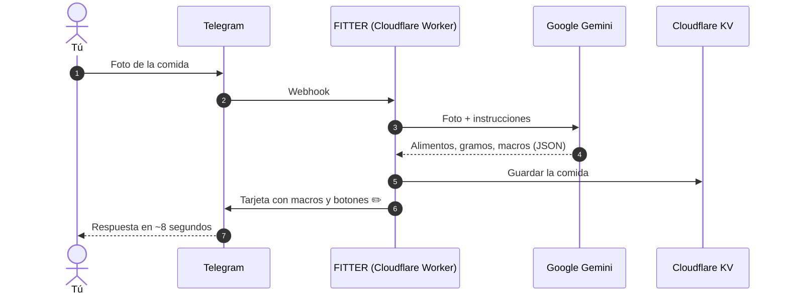

[Русский](README.md) · [English](README.en.md) · **Español** · [Português](README.pt.md) · [Deutsch](README.de.md) · [Français](README.fr.md)

 

&nbsp;&nbsp;

<a href="#-funciones">Funciones</a> · <a href="#-cómo-funciona">Cómo funciona</a> · <a href="#-capturas">Capturas</a> · <a href="https://t.me/arkhitkovv">Contacto</a>

> [!IMPORTANT]
> **FITTER calcula las calorías de forma aproximada.** El resultado de una foto depende de los ingredientes y del tamaño de la ración, y cualquier registro se puede corregir a mano. El bot no sustituye la consulta con un médico o nutricionista.

> [!NOTE]
> Por ahora el bot habla ruso. Esta página es una traducción del [README en ruso](README.md).

---

## 📸 Capturas

  

---

## ✨ Funciones

<table>
  <tr>
    <td width="50%" valign="top">

      <h3>📷 Registro de comidas</h3>
      <ul>
        <li>Reconocimiento de platos por foto: alimentos, gramos y macros por 100 g</li>
        <li>El pie de foto sirve de pista: «son 200 g de arroz»</li>
        <li>Registro por texto: «comí 2 huevos y una tostada»</li>
        <li>Corrige el nombre o los gramos y la IA recalcula los macros</li>
        <li>Borra registros con un toque</li>
      </ul>
    
</td>
    <td width="50%" valign="top">

      <h3>🏷️ Productos envasados</h3>
      <ul>
        <li>Foto de la etiqueta nutricional: el bot copia los valores tal cual</li>
        <li>Lectura del código de barras y búsqueda en <a href="https://world.openfoodfacts.org">Open Food Facts</a></li>
        <li>O simplemente envía los dígitos del código</li>
      </ul>
    
</td>
  </tr>
  <tr>
    <td width="50%" valign="top">

      <h3>🎯 Objetivos y progreso</h3>
      <ul>
        <li>Encuesta de 6 preguntas y objetivo diario según la fórmula de Mifflin–St Jeor</li>
        <li>Objetivos: perder peso, mantenerlo o ganar masa</li>
        <li>Resumen del día y de la semana: comido, restante y excesos</li>
        <li>Registro de peso con gráfico y recálculo automático del objetivo</li>
      </ul>
    
</td>
    <td width="50%" valign="top">

      <h3>💧 Agua y pastillas</h3>
      <ul>
        <li>Objetivo de agua de 30 ml por kg de peso, botones +250 y +500 ml</li>
        <li>Recordatorios cada 30 minutos a 2 horas, silencio por la noche</li>
        <li>Vitaminas y medicamentos por hora de toma</li>
        <li>Botones «Tomado», «En 30 min» y «Omitir»</li>
      </ul>
    
</td>
  </tr>
  <tr>
    <td width="50%" valign="top">

      <h3>🧠 Asistente con IA</h3>
      <ul>
        <li>«Qué comer»: 3 opciones según las calorías y proteínas que te quedan</li>
        <li>Cualquier opción va al diario con un botón</li>
        <li>Resumen semanal con nota, elogios y 3 consejos</li>
        <li>Respuestas sobre nutrición que tienen en cuenta tu objetivo</li>
      </ul>
    
</td>
    <td width="50%" valign="top">

      <h3>🏆 Hábitos</h3>
      <ul>
        <li>Una racha de días seguidos que no querrás romper</li>
        <li>13 logros: rachas, días en objetivo, agua, etiquetas, peso</li>
        <li>Animaciones de celebración al cumplir el objetivo</li>
      </ul>
    
</td>
  </tr>
  <tr>
    <td width="50%" valign="top">

      <h3>📱 Diario (Mini App)</h3>
      <ul>
        <li>Anillo de calorías, calendario y gráfico semanal, tarjetas de macros con consejos</li>
        <li>Vaso de agua con ola y botones ±250 ml</li>
        <li>Registro por texto, también de días anteriores</li>
        <li>Tema claro y oscuro</li>
      </ul>
    
</td>
    <td width="50%" valign="top">

      <h3>🎨 Diseño y fiabilidad</h3>
      <ul>
        <li>Set de iconos propio, <a href="icons/">FITTER Icons</a></li>
        <li>Cambio automático a un modelo Gemini de reserva</li>
        <li>Límite de 24 s para la IA: respuesta clara en lugar de carga infinita</li>
        <li>Un límite diario de solicitudes protege la cuota gratuita</li>
      </ul>
    
</td>
  </tr>
</table>

---

## 🤖 Comandos

| Comando | Qué hace |
|:---|:---|
| `/start` | Presentación y encuesta |
| `/today` · `/week` | Resumen de hoy y de los últimos 7 días |
| `/water` · `/remind` | Agua de hoy y recordatorios |
| `/advice` | Qué comer: 3 sugerencias de la IA |
| `/pills` | Pastillas: marcar, añadir, borrar |
| `/weight 72.5` | Registrar el peso |
| `/profile` | Perfil y objetivo diario |
| `/awards` · `/analysis` | Logros y resumen semanal con IA |
| `/app` | Abrir el diario |
| `/reset` · `/help` | Repetir la encuesta y ayuda |
| `/delete` | Borrar todos tus datos |

---

## 🧠 Cómo funciona

| Capa | Tecnología | Por qué |
|:---|:---|:---|
| Interfaz | Telegram Bot API + Mini App | Todo el mundo tiene Telegram, no hay nada que descargar |
| Servidor | Cloudflare Workers | Gratis, 24/7, sin servidores que mantener |
| IA | Google Gemini (Flash / Flash-Lite) | Entiende fotos y responde en JSON estricto |
| Base de datos | Cloudflare KV | Gratis e integrada en Workers |
| Despliegue | GitHub → Cloudflare Builds | Cada commit llega solo al servidor |

Todo el servidor es un único archivo, [`worker.js`](worker.js), sin dependencias.

---

## 🔒 Seguridad y privacidad

- El webhook solo acepta solicitudes con la cabecera secreta de Telegram.
- El diario comprueba la firma criptográfica de Telegram: nadie puede abrir datos ajenos.
- Las claves están en los secretos de Cloudflare, no en el código.
- Las fotos **no se guardan**: solo se envían a Gemini para el reconocimiento.

Más información: [política de privacidad](https://sailxx.github.io/FITTER-AI/privacy.html) (en ruso).

---

## 🗺 Hoja de ruta

- [x] **v1** Bot en Cloudflare, encuesta, objetivo, registro por foto, diario, peso, agua, etiquetas y códigos de barras
- [x] **v2** Asistente «Qué comer», pastillas con recordatorios, estadísticas, tema claro y oscuro
- [x] **v2.6** Nuevo diseño del diario, consejos de macros, gráfico semanal; agua y pastillas renovadas en el bot
- [ ] **v3.0** Producto: suscripción y app independiente

Historial completo: [CHANGELOG.md](CHANGELOG.md) (en ruso).

---

## ❓ Preguntas e ideas

¿Encontraste un error o tienes una idea? Abre un [issue](https://github.com/sailxx/FITTER-AI/issues/new) o escribe al autor en Telegram: [@arkhitkovv](https://t.me/arkhitkovv).

---

## ⚖️ Licencia

FITTER se distribuye bajo la licencia **MIT**, consulta [LICENSE](LICENSE). Es un proyecto independiente y no está vinculado a Telegram, Google ni Cloudflare. Los nombres pertenecen a sus propietarios.

   
  
   
  <b>FITTER</b> · Una foto. Control total.
   
  Hecho por <a href="https://t.me/arkhitkovv">Vlad</a>. Si el proyecto te sirvió, dale una ⭐ al repositorio.

