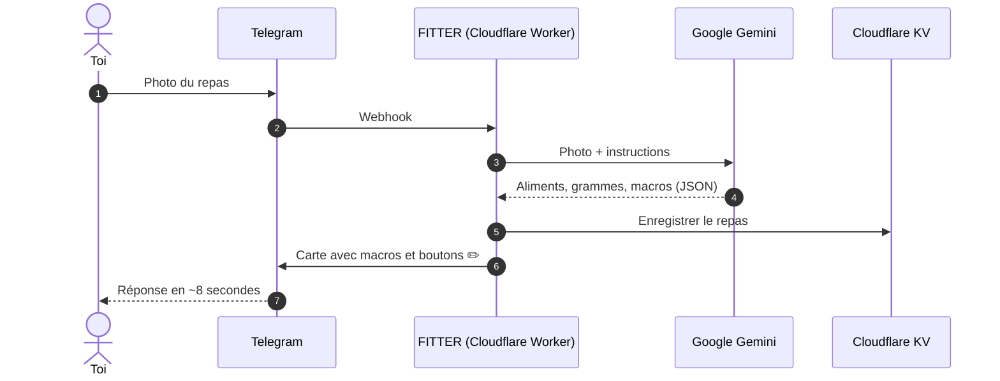

[Русский](README.md) · [English](README.en.md) · [Español](README.es.md) · [Português](README.pt.md) · [Deutsch](README.de.md) · **Français**

 

&nbsp;&nbsp;

<a href="#-fonctionnalités">Fonctionnalités</a> · <a href="#-comment-ça-marche">Comment ça marche</a> · <a href="#-captures-décran">Captures</a> · <a href="https://t.me/arkhitkovv">Contact</a>

> [!IMPORTANT]
> **FITTER estime les calories de façon approximative.** Le résultat d’une photo dépend des ingrédients et de la taille de la portion, et chaque entrée peut être corrigée à la main. Le bot ne remplace pas l’avis d’un médecin ou d’un diététicien.

> [!NOTE]
> Pour l’instant, le bot parle russe. Cette page est une traduction du [README en russe](README.md).

---

## 📸 Captures d’écran

  

---

## ✨ Fonctionnalités

<table>
  <tr>
    <td width="50%" valign="top">

      <h3>📷 Noter ses repas</h3>
      <ul>
        <li>Reconnaissance des plats par photo : aliments, grammes et macros pour 100 g</li>
        <li>La légende de la photo sert d’indice : « c’est 200 g de riz »</li>
        <li>Saisie par texte : « j’ai mangé 2 œufs et un toast »</li>
        <li>Modifie le nom ou les grammes, l’IA recalcule les macros</li>
        <li>Supprime une entrée d’un seul geste</li>
      </ul>
    
</td>
    <td width="50%" valign="top">

      <h3>🏷️ Produits emballés</h3>
      <ul>
        <li>Photo de l’étiquette nutritionnelle : le bot recopie les valeurs exactes</li>
        <li>Lecture du code-barres et recherche dans <a href="https://world.openfoodfacts.org">Open Food Facts</a></li>
        <li>Ou envoie simplement les chiffres du code-barres</li>
      </ul>
    
</td>
  </tr>
  <tr>
    <td width="50%" valign="top">

      <h3>🎯 Objectifs et progrès</h3>
      <ul>
        <li>Questionnaire de 6 questions et objectif quotidien selon la formule de Mifflin–St Jeor</li>
        <li>Objectifs : perdre du poids, le maintenir ou prendre du muscle</li>
        <li>Bilan du jour et de la semaine : mangé, restant, dépassements</li>
        <li>Suivi du poids avec graphique et ajustement automatique de l’objectif</li>
      </ul>
    
</td>
    <td width="50%" valign="top">

      <h3>💧 Eau et médicaments</h3>
      <ul>
        <li>Objectif d’eau de 30 ml par kg de poids, boutons +250 et +500 ml</li>
        <li>Rappels toutes les 30 minutes à 2 heures, silence la nuit</li>
        <li>Vitamines et médicaments selon l’heure de prise</li>
        <li>Boutons « Pris », « Dans 30 min » et « Passer »</li>
      </ul>
    
</td>
  </tr>
  <tr>
    <td width="50%" valign="top">

      <h3>🧠 Assistant IA</h3>
      <ul>
        <li>« Quoi manger » : 3 idées adaptées aux calories et protéines restantes</li>
        <li>Chaque idée va dans le journal d’un seul bouton</li>
        <li>Bilan de la semaine avec note, encouragements et 3 conseils</li>
        <li>Réponses aux questions de nutrition qui tiennent compte de ton objectif</li>
      </ul>
    
</td>
    <td width="50%" valign="top">

      <h3>🏆 Habitudes</h3>
      <ul>
        <li>Une série de jours d’affilée que tu n’auras pas envie de casser</li>
        <li>13 succès : séries, jours dans l’objectif, eau, étiquettes, poids</li>
        <li>Animations de fête quand tu atteins ton objectif</li>
      </ul>
    
</td>
  </tr>
  <tr>
    <td width="50%" valign="top">

      <h3>📱 Journal (Mini App)</h3>
      <ul>
        <li>Anneau de calories, calendrier et graphique de la semaine, cartes de macros avec conseils</li>
        <li>Verre d’eau avec vague et boutons ±250 ml</li>
        <li>Saisie par texte, y compris pour les jours passés</li>
        <li>Thème clair et sombre</li>
      </ul>
    
</td>
    <td width="50%" valign="top">

      <h3>🎨 Design et fiabilité</h3>
      <ul>
        <li>Jeu d’icônes maison, <a href="icons/">FITTER Icons</a></li>
        <li>Bascule automatique vers un modèle Gemini de secours</li>
        <li>Délai de 24 s pour l’IA : une réponse claire au lieu d’un chargement sans fin</li>
        <li>Une limite quotidienne de requêtes protège le quota gratuit</li>
      </ul>
    
</td>
  </tr>
</table>

---

## 🤖 Commandes

| Commande | Ce qu’elle fait |
|:---|:---|
| `/start` | Présentation et questionnaire |
| `/today` · `/week` | Bilan du jour et des 7 derniers jours |
| `/water` · `/remind` | Eau du jour et rappels |
| `/advice` | Quoi manger : 3 idées de l’IA |
| `/pills` | Médicaments : cocher, ajouter, supprimer |
| `/weight 72.5` | Noter son poids |
| `/profile` | Profil et objectif quotidien |
| `/awards` · `/analysis` | Succès et bilan IA de la semaine |
| `/app` | Ouvrir le journal |
| `/reset` · `/help` | Refaire le questionnaire et aide |
| `/delete` | Supprimer toutes tes données |

---

## 🧠 Comment ça marche

| Couche | Technologie | Pourquoi |
|:---|:---|:---|
| Interface | Telegram Bot API + Mini App | Tout le monde a déjà Telegram, rien à télécharger |
| Serveur | Cloudflare Workers | Gratuit, 24 h/24, aucun serveur à gérer |
| IA | Google Gemini (Flash / Flash-Lite) | Comprend les photos, répond en JSON strict |
| Base de données | Cloudflare KV | Gratuite et intégrée à Workers |
| Déploiement | GitHub → Cloudflare Builds | Chaque commit arrive tout seul sur le serveur |

Tout le serveur tient dans un seul fichier, [`worker.js`](worker.js), sans aucune dépendance.

---

## 🔒 Sécurité et confidentialité

- Le webhook n’accepte que les requêtes avec l’en-tête secret de Telegram.
- Le journal vérifie la signature cryptographique de Telegram : impossible d’ouvrir les données d’un autre.
- Les clés sont dans les secrets Cloudflare, pas dans le code.
- Les photos **ne sont pas conservées** : elles partent vers Gemini uniquement pour la reconnaissance.

En savoir plus : [politique de confidentialité](https://sailxx.github.io/FITTER-AI/privacy.html) (en russe).

---

## 🗺 Feuille de route

- [x] **v1** Bot sur Cloudflare, questionnaire, objectif, saisie par photo, journal, poids, eau, étiquettes et codes-barres
- [x] **v2** Assistant « Quoi manger », médicaments avec rappels, statistiques, thème clair et sombre
- [x] **v2.6** Nouveau design du journal, conseils de macros, graphique de la semaine ; eau et médicaments repensés dans le bot
- [ ] **v3.0** Produit : application autonome

Historique complet : [CHANGELOG.md](CHANGELOG.md) (en russe).

---

## ❓ Questions et idées

Tu as trouvé un bug ou tu as une idée ? Ouvre une [issue](https://github.com/sailxx/FITTER-AI/issues/new) ou écris à l’auteur sur Telegram : [@arkhitkovv](https://t.me/arkhitkovv).

---

## ⚖️ Licence

FITTER est distribué sous licence **MIT**, voir [LICENSE](LICENSE). C’est un projet indépendant, sans lien avec Telegram, Google ou Cloudflare. Les noms appartiennent à leurs propriétaires.

   
  
   
  <b>FITTER</b> · Une photo. Le contrôle total.
   
  Fait par <a href="https://t.me/arkhitkovv">Vlad</a>. Si le projet t’a servi, laisse une ⭐ au dépôt.

