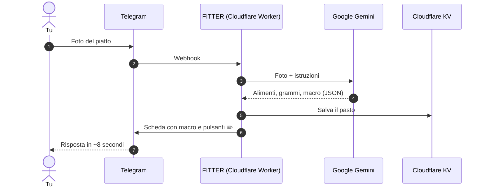

[Русский](README.md) · [English](README.en.md) · [Español](README.es.md) · [Português](README.pt.md) · [Deutsch](README.de.md) · [Français](README.fr.md) · **Italiano** · [Türkçe](README.tr.md) · [Українська](README.uk.md) · [Polski](README.pl.md)

 

&nbsp;&nbsp;

<a href="#-funzioni">Funzioni</a> · <a href="#-come-funziona">Come funziona</a> · <a href="#-screenshot">Screenshot</a> · <a href="https://t.me/arkhitkovv">Contatti</a>

> [!IMPORTANT]
> **FITTER stima le calorie in modo approssimativo.** Il risultato da foto dipende dagli ingredienti e dalla dimensione della porzione, e ogni voce si può correggere a mano. Il bot non sostituisce il parere di un medico o di un dietologo.

> [!NOTE]
> Per ora il bot parla russo. Questa pagina è una traduzione del [README in russo](README.md).

---

## 📸 Screenshot

  

---

## ✨ Funzioni

<table>
  <tr>
    <td width="50%" valign="top">

      <h3>📷 Registrare il cibo</h3>
      <ul>
        <li>Riconoscimento del piatto da foto: alimenti, grammi e macro per 100 g</li>
        <li>La didascalia della foto fa da suggerimento: «sono 200 g di riso»</li>
        <li>Registrazione a testo: «ho mangiato 2 uova e un toast»</li>
        <li>Modifica il nome o i grammi e l’IA ricalcola le macro</li>
        <li>Elimina le voci con un tocco</li>
      </ul>
    
</td>
    <td width="50%" valign="top">

      <h3>🏷️ Prodotti confezionati</h3>
      <ul>
        <li>Foto dell’etichetta nutrizionale: il bot copia i valori esattamente</li>
        <li>Lettura del codice a barre e ricerca su <a href="https://world.openfoodfacts.org">Open Food Facts</a></li>
        <li>Oppure invia solo le cifre del codice a barre</li>
      </ul>
    
</td>
  </tr>
  <tr>
    <td width="50%" valign="top">

      <h3>🎯 Obiettivi e progressi</h3>
      <ul>
        <li>Un questionario di 6 domande e un fabbisogno giornaliero con la formula di Mifflin–St Jeor</li>
        <li>Obiettivi: dimagrire, mantenere il peso o aumentare la massa</li>
        <li>Riepiloghi del giorno e della settimana: mangiato, rimasto, dove hai sforato</li>
        <li>Monitoraggio del peso con grafico e aggiornamento automatico del fabbisogno</li>
      </ul>
    
</td>
    <td width="50%" valign="top">

      <h3>💧 Acqua e integratori</h3>
      <ul>
        <li>Obiettivo d’acqua di 30 ml per kg di peso, pulsanti +250 e +500 ml</li>
        <li>Promemoria da ogni 30 minuti a ogni 2 ore, silenzio di notte</li>
        <li>Vitamine e farmaci in base all’orario di assunzione</li>
        <li>Pulsanti «Preso», «Tra 30 min» e «Salta»</li>
      </ul>
    
</td>
  </tr>
  <tr>
    <td width="50%" valign="top">

      <h3>🧠 Assistente IA</h3>
      <ul>
        <li>«Cosa mangiare»: 3 opzioni adatte alle calorie e alle proteine rimaste</li>
        <li>Ogni opzione finisce nel diario con un pulsante</li>
        <li>Analisi settimanale con voto, complimenti e 3 consigli</li>
        <li>Risposte a domande sull’alimentazione che tengono conto del tuo fabbisogno</li>
      </ul>
    
</td>
    <td width="50%" valign="top">

      <h3>🏆 Abitudini</h3>
      <ul>
        <li>Una serie di giorni che non vorrai interrompere</li>
        <li>13 traguardi: serie, giorni nell’obiettivo, acqua, etichette, peso</li>
        <li>Animazioni di festa quando raggiungi l’obiettivo</li>
      </ul>
    
</td>
  </tr>
  <tr>
    <td width="50%" valign="top">

      <h3>📱 Diario (Mini App)</h3>
      <ul>
        <li>Anello delle calorie, calendario e grafico della settimana, schede delle macro con suggerimenti</li>
        <li>Bicchiere d’acqua con l’onda e pulsanti ±250 ml</li>
        <li>Registrazione del cibo a testo, anche per i giorni passati</li>
        <li>Tema chiaro e scuro</li>
      </ul>
    
</td>
    <td width="50%" valign="top">

      <h3>🎨 Design e affidabilità</h3>
      <ul>
        <li>Un set di icone proprio, <a href="icons/">FITTER Icons</a></li>
        <li>Passaggio automatico a un modello Gemini di riserva</li>
        <li>Timeout dell’IA di 24 secondi: una risposta chiara invece di un caricamento infinito</li>
        <li>Un limite giornaliero di richieste protegge la quota gratuita</li>
      </ul>
    
</td>
  </tr>
</table>

---

## 🤖 Comandi

| Comando | Cosa fa |
|:---|:---|
| `/start` | Presentazione e questionario |
| `/today` · `/week` | Riepilogo di oggi e degli ultimi 7 giorni |
| `/water` · `/remind` | Acqua di oggi e promemoria |
| `/advice` | Cosa mangiare: 3 proposte dell’IA |
| `/pills` | Integratori: segnare, aggiungere, eliminare |
| `/weight 72.5` | Registrare il peso |
| `/profile` | Profilo e fabbisogno giornaliero |
| `/awards` · `/analysis` | Traguardi e analisi settimanale dell’IA |
| `/app` | Aprire il diario |
| `/reset` · `/help` | Rifare il questionario e aiuto |
| `/delete` | Eliminare tutti i tuoi dati |

---

## 🧠 Come funziona

| Livello | Tecnologia | Perché |
|:---|:---|:---|
| Interfaccia | Telegram Bot API + Mini App | Tutti hanno già Telegram, niente da scaricare |
| Server | Cloudflare Workers | Gratis, 24/7, nessun server da gestire |
| IA | Google Gemini (Flash / Flash-Lite) | Capisce le foto, risponde in JSON rigoroso |
| Database | Cloudflare KV | Gratis e integrato in Workers |
| Deploy | GitHub → Cloudflare Builds | Ogni commit arriva sul server da solo |

L’intero server è un solo file, [`worker.js`](worker.js), senza dipendenze.

---

## 🔒 Sicurezza e privacy

- Il webhook accetta solo richieste con l’intestazione segreta di Telegram.
- Il diario verifica la firma crittografica di Telegram, così nessuno può aprire i dati di un altro.
- Le chiavi sono nei secret di Cloudflare, non nel codice.
- Le foto **non vengono conservate**: vanno a Gemini solo per il riconoscimento.

Altro: [informativa sulla privacy](https://sailxx.github.io/FITTER-AI/privacy.html) (in russo).

---

## 🗺 Roadmap

- [x] **v1** Bot su Cloudflare, questionario, fabbisogno, registrazione da foto, diario, peso, acqua, etichette e codici a barre
- [x] **v2** Assistente «Cosa mangiare», integratori con promemoria, statistiche, tema chiaro e scuro
- [x] **v2.6** Nuovo aspetto del diario, suggerimenti sulle macro, grafico della settimana; acqua e integratori ridisegnati nel bot
- [ ] **v3.0** Prodotto: app indipendente

Cronologia completa: [CHANGELOG.md](CHANGELOG.md) (in russo).

---

## ❓ Domande e idee

Hai trovato un bug o hai un’idea? Apri una [issue](https://github.com/sailxx/FITTER-AI/issues/new) o scrivi all’autore su Telegram: [@arkhitkovv](https://t.me/arkhitkovv).

---

## ⚖️ Licenza

FITTER è distribuito con licenza **MIT**, vedi [LICENSE](LICENSE). È un progetto indipendente, non affiliato a Telegram, Google o Cloudflare. Tutti i nomi appartengono ai rispettivi proprietari.

   
  
   
  <b>FITTER</b> · Una foto. Pieno controllo.
   
  Creato da <a href="https://t.me/arkhitkovv">Vlad</a>. Se il progetto ti è stato utile, lascia una ⭐ al repository.

