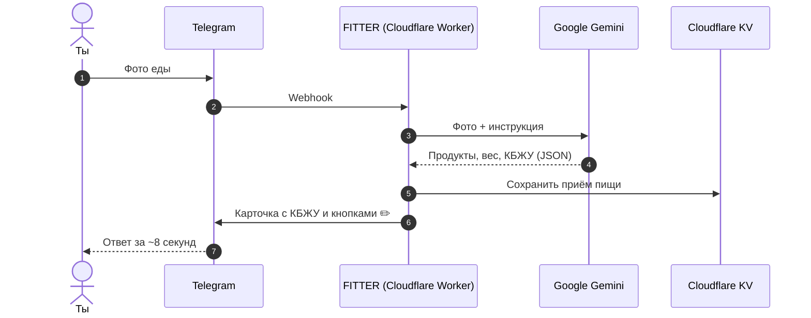

**Русский** · [English](README.en.md) · [Español](README.es.md) · [Português](README.pt.md) · [Deutsch](README.de.md) · [Français](README.fr.md) · [Italiano](README.it.md) · [Türkçe](README.tr.md) · [Українська](README.uk.md) · [Polski](README.pl.md)

 

&nbsp;&nbsp;

<a href="#-возможности">Возможности</a> · <a href="#-как-это-работает">Как работает</a> · <a href="#-скриншоты">Скриншоты</a> · <a href="https://t.me/arkhitkovv">Связь</a>

> [!IMPORTANT]
> **FITTER оценивает калории приблизительно.** Результат по фото зависит от состава и размера порции, а любую запись можно поправить вручную. Бот не заменяет консультацию врача или диетолога.

---

## 📸 Скриншоты

  

---

## ✨ Возможности

<table>
  <tr>
    <td width="50%" valign="top">
      

        <h3>📷 Запись еды</h3>
        <ul>
          <li>Распознавание блюд по фото: продукты, вес и КБЖУ на 100 г</li>
          <li>Подпись к фото работает как подсказка: «это 200 г риса»</li>
          <li>Запись текстом: «съел 2 яйца и тост»</li>
          <li>Правка названия и граммов, нейросеть пересчитывает КБЖУ</li>
          <li>Удаление записей в один клик</li>
        </ul>
      

    </td>
    <td width="50%" valign="top">
      

        <h3>🏷️ Упаковки</h3>
        <ul>
          <li>Фото этикетки: бот перепишет КБЖУ точно с неё</li>
          <li>Чтение штрихкода и поиск в базе <a href="https://world.openfoodfacts.org">Open Food Facts</a></li>
          <li>Можно просто прислать цифры штрихкода</li>
        </ul>
      

    </td>
  </tr>
  <tr>
    <td width="50%" valign="top">
      

        <h3>🎯 Цели и прогресс</h3>
        <ul>
          <li>Анкета из 6 вопросов и норма по формуле Миффлина — Сан-Жеора</li>
          <li>Цели: похудеть, держать вес или набрать массу</li>
          <li>Итоги дня и недели: съедено, осталось, где перебор</li>
          <li>Учёт веса с графиком и автопересчётом нормы</li>
        </ul>
      

    </td>
    <td width="50%" valign="top">
      

        <h3>💧 Вода и таблетки</h3>
        <ul>
          <li>Норма воды 30 мл на 1 кг веса, кнопки +250 и +500 мл</li>
          <li>Напоминания каждые 30 минут — 2 часа, ночью тишина</li>
          <li>Витамины и лекарства по времени приёма</li>
          <li>Кнопки «Принял», «Через 30 мин» и «Пропустить»</li>
        </ul>
      

    </td>
  </tr>
  <tr>
    <td width="50%" valign="top">
      

        <h3>🧠 ИИ-ассистент</h3>
        <ul>
          <li>«Что съесть»: 3 варианта под остаток калорий и белка</li>
          <li>Любой вариант попадает в дневник одной кнопкой</li>
          <li>Разбор недели с оценкой, похвалой и 3 советами</li>
          <li>Ответы на вопросы о питании с учётом твоей нормы</li>
        </ul>
      

    </td>
    <td width="50%" valign="top">
      

        <h3>🏆 Привычки</h3>
        <ul>
          <li>Серия дней подряд, которую жалко прерывать</li>
          <li>13 достижений: серии, дни в норме, вода, этикетки, вес</li>
          <li>Анимации-праздники при выполнении нормы</li>
        </ul>
      

    </td>
  </tr>
  <tr>
    <td width="50%" valign="top">
      

        <h3>📱 Дневник (Mini App)</h3>
        <ul>
          <li>Кольцо калорий, календарь недели, карточки БЖУ</li>
          <li>Стакан воды с волной и кнопками ±250 мл</li>
          <li>Запись еды текстом и дописывание за прошлые дни</li>
          <li>Светлая и тёмная тема Telegram</li>
        </ul>
      

    </td>
    <td width="50%" valign="top">
      

        <h3>🎨 Дизайн и надёжность</h3>
        <ul>
          <li>Собственный набор иконок <a href="icons/">FITTER Icons</a></li>
          <li>Автопереход на запасную модель Gemini при сбое</li>
          <li>Таймаут ИИ 24 секунды: понятный ответ вместо вечной загрузки</li>
          <li>Дневной лимит запросов защищает бесплатную квоту</li>
        </ul>
      

    </td>
  </tr>
</table>

---

## 🤖 Команды

| Команда | Что делает |
|:---|:---|
| `/start` | Знакомство и анкета |
| `/today` · `/week` | Итоги дня и последние 7 дней |
| `/water` · `/remind` | Вода за сегодня и напоминания |
| `/advice` | Что съесть: 3 варианта от ИИ |
| `/pills` | Таблетки: отметить, добавить, удалить |
| `/weight 72.5` | Записать вес |
| `/profile` | Профиль и дневная норма |
| `/awards` · `/analysis` | Достижения и ИИ-разбор недели |
| `/app` | Открыть дневник |
| `/reset` · `/help` | Пройти анкету заново и справка |
| `/delete` | Удалить все свои данные |

---

## 🧠 Как это работает

| Слой | Технология | Почему |
|:---|:---|:---|
| Интерфейс | Telegram Bot API + Mini App | У всех уже есть Telegram, ничего не нужно скачивать |
| Сервер | Cloudflare Workers | Бесплатно, 24/7, без настройки серверов |
| ИИ | Google Gemini (Flash / Flash-Lite) | Понимает фото, ответ в строгом JSON |
| База | Cloudflare KV | Бесплатно и встроена в Workers |
| Деплой | GitHub → Cloudflare Builds | Каждый коммит сам попадает на сервер |

Весь сервер — один файл [`worker.js`](worker.js) без единой зависимости.

---

## 🔒 Безопасность и приватность

- Webhook принимает запросы только с секретным заголовком Telegram.
- Дневник проверяет криптографическую подпись Telegram: чужие данные открыть нельзя.
- Ключи лежат в секретах Cloudflare, а не в коде.
- Фото **не сохраняются**: они уходят в Gemini только для распознавания.

Подробнее: [политика конфиденциальности](https://sailxx.github.io/FITTER-AI/privacy.html).

---

## 🗺 Дорожная карта

- [x] **v1.0** Бот на Cloudflare, анкета, норма, фото, дневник, учёт веса
- [x] **v1.x** Точность, свои иконки, вода, этикетки и штрихкоды, новый дневник
- [x] **v1.6–1.7** Серии, достижения, ИИ-разбор недели, напоминания о воде
- [x] **v2.0** Ассистент «Что съесть» и новая «Неделя»
- [x] **v2.1** Таблетки и витамины с напоминаниями
- [x] **v2.2–2.4** Аналитика, светлая и тёмная тема, цветные иконки
- [x] **v2.5** Таблетки в меню бота, вес в профиле и дневнике
- [x] **v2.5.1** Безопасность: команда /delete, строже служебные команды и /setup
- [x] **v2.5.2** Дневник сам подтягивает отметки таблеток и записи из чата
- [x] **v2.5.3** Защита дневника (CSP) и честный лимит ИИ
- [x] **v2.6** Новый вид дневника: яркая шапка, подсказки по БЖУ и график недели
- [x] **v2.6.1** Короткое меню бота: без кнопок «Вода» и «Таблетки»
- [x] **v2.7** Аккуратные сообщения бота: больше воздуха, без цитат-блоков
- [x] **v2.8** Эксклюзивная тема Okto в честь запуска приложения Okto, классический вид — по кнопке; вода стаканами
- [ ] **v3.0** Продукт: отдельное приложение

Полная история версий — в [CHANGELOG.md](CHANGELOG.md).

---

## ❓ Вопросы и идеи

Нашёл ошибку или хочешь предложить фичу? Открой [issue](https://github.com/sailxx/FITTER-AI/issues/new) или напиши автору.

---

## ⚖️ Лицензия

FITTER распространяется по лицензии **MIT**, см. файл [LICENSE](LICENSE). Проект независимый и не связан с Telegram, Google или Cloudflare. Названия принадлежат их владельцам.

   
  
   
  <b>FITTER</b> · Одно фото. Полный контроль.
   
  Сделал <a href="https://t.me/arkhitkovv">Владислав</a>. Если проект пригодился, поставь ⭐ репозиторию.

