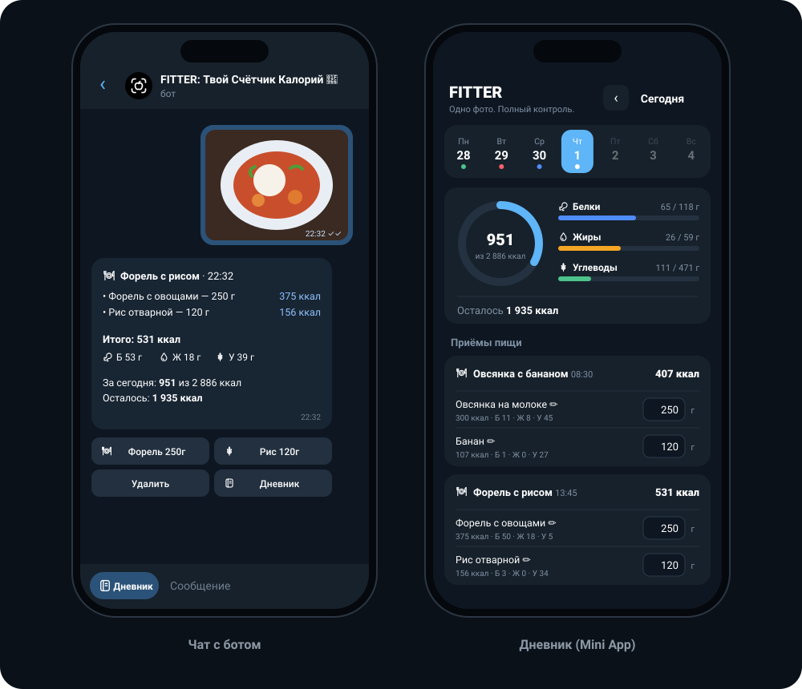
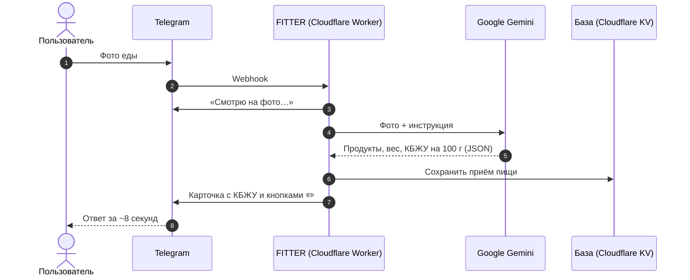
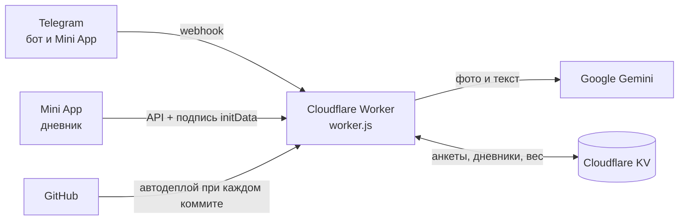

<div align="center">


# FITTER

### Твой счётчик калорий 🥦

**Одно фото. Полный контроль.**

Сфотографируй еду — нейросеть найдёт продукты, оценит вес, посчитает калории, белки, жиры и углеводы и запишет всё в дневник питания. Прямо в Telegram, без скачивания приложений.

[](https://t.me/FitterFoodBot)


[**Открыть бота**](https://t.me/FitterFoodBot) · [**Запустить свою копию**](SETUP.md) · [**Возможности**](#-возможности) · [**Как это устроено**](#-как-это-устроено)

<br>



</div>

<br>

## 📌 О проекте

Считать калории полезно, но неудобно: нужно взвешивать каждый продукт, искать его состав и складывать всё вручную. Поэтому большинство людей бросает подсчёт уже через несколько дней.

**FITTER** убирает рутину. Достаточно отправить фото тарелки — остальное сделает искусственный интеллект. Бот живёт в Telegram, поэтому им можно пользоваться сразу, без установки и регистрации.

| | |
|---|---|
| 📸 **Фото вместо таблиц** | Нейросеть распознаёт продукты и вес порции за несколько секунд |
| ✏️ **Можно поправить** | Ошиблась с продуктом или весом — исправь, и КБЖУ пересчитаются |
| 📅 **Дневник по дням** | Mini App с календарём, кольцом калорий и графиком веса |
| 💸 **Бесплатно** | Работает на бесплатных тарифах Cloudflare и Google Gemini |

<br>

## ✨ Возможности

### Подсчёт еды
- **Распознавание по фото.** Gemini находит каждый продукт на тарелке, оценивает вес и КБЖУ на 100 г. Подпись к фото работает как подсказка: «это 200 г риса».
- **Запись текстом.** «Съел 2 яйца и тост» — бот сам разберёт и запишет.
- **Исправление ошибок.** Кнопка ✏️ у каждого продукта: можно поменять вес (`150`), название (`форель`) или всё сразу (`форель 200 г`). При смене названия нейросеть заново считает КБЖУ для нового продукта.
- **Упаковки и этикетки.** Сфотографируй этикетку, и бот перепишет КБЖУ точно с неё. Не видно этикетки? Бот прочитает штрихкод и найдёт продукт в открытой базе [Open Food Facts](https://world.openfoodfacts.org). Можно просто прислать цифры штрихкода.
- **Удаление записей** в один клик.

### Цели и прогресс
- **Персональная норма.** Анкета из 6 вопросов и расчёт по формуле Миффлина — Сан‑Жеора с учётом активности и цели: похудеть, держать вес или набрать массу.
- **Итоги дня и недели.** Сколько съедено, сколько осталось, где перебор.
- **Учёт веса.** История, разница с прошлым замером и автоматический пересчёт нормы.
- **Вода.** Норма 30 мл на 1 кг веса, кнопки +250 и +500 мл или текстом: «вода 300», «+500», «2 стакана воды».

### Дневник (Telegram Mini App)
- Яркая шапка с большим кольцом калорий и календарём недели.
- Карточки белков, жиров и углеводов с цветными иконками FITTER.
- Стакан воды, который наполняется волной, и кнопки ±250 мл.
- Живой интерфейс: кнопки пружинят и отвечают вибрацией, кольцо и полоски плавно заполняются, а на норме воды и калорий — салют из капель и звёздочек. В чате на норме воды срабатывает анимация 🎉 на весь экран.
- Правка граммов и названий прямо в дневнике.
- График веса.
- Подстраивается под светлую и тёмную тему Telegram.

### ИИ‑ассистент
- Отвечает на вопросы о питании с учётом твоей нормы и того, что ты уже съел сегодня: «что съесть на ужин, чтобы добрать белок?»

### Оформление
- Свои иконки в стиле iOS вместо обычных эмодзи в сообщениях и на кнопках — набор [**FITTER Icons**](icons/), нарисованный специально для проекта.

<br>

## 🤖 Команды бота

| Команда | Что делает |
|---|---|
| `/start` | Знакомство и анкета |
| `/today` | Итоги дня |
| `/week` | Последние 7 дней |
| `/water` | Вода за сегодня |
| `/weight 72.5` | Записать вес |
| `/profile` | Профиль и дневная норма |
| `/app` | Открыть дневник |
| `/reset` | Пройти анкету заново |
| `/help` | Как пользоваться |

<details>
<summary><b>Служебные команды</b></summary>

| Команда | Что делает |
|---|---|
| `/emojipack имя` | Показать все иконки набора с номерами |
| `/emojiid` | Узнать номер иконки: отправь её боту |
| `/makeemoji` | Создать набор FITTER Icons и подключить к боту |

</details>

<br>

## 🧠 Как это устроено



### Архитектура



| Слой | Технология | Почему |
|---|---|---|
| Интерфейс | Telegram Bot API + Mini App | Не нужно скачивать приложение, у всех уже есть Telegram |
| Сервер | Cloudflare Workers | Бесплатно, работает 24/7, без настройки серверов |
| ИИ | Google Gemini (Flash / Flash‑Lite) | Понимает фото, бесплатный ключ, ответ в строгом JSON |
| База данных | Cloudflare KV | Бесплатно, встроена в Workers |
| Деплой | GitHub → Cloudflare Builds | Каждый коммит автоматически попадает на сервер |

**Надёжность.** Если основная модель Gemini недоступна, бот сам переключается на запасную и запоминает рабочую. Если нейросеть не ответила за 24 секунды, пользователь получает понятное сообщение, а не «вечную загрузку». Если Telegram не принял свои иконки, сообщение уходит с обычными эмодзи.

<br>

## 🚀 Быстрый старт

Свою копию бота можно запустить бесплатно примерно за 20 минут, программировать не нужно.

1. Создай бота в [@BotFather](https://t.me/BotFather) и получи токен
2. Получи бесплатный ключ Gemini в [Google AI Studio](https://aistudio.google.com/apikey)
3. Создай Worker в [Cloudflare](https://dash.cloudflare.com) и подключи этот репозиторий
4. Создай базу KV и привяжи её под именем `DB`
5. Добавь секреты и открой `/setup?secret=…`

📖 Подробная инструкция для новичков — в **[SETUP.md](SETUP.md)**.

<details>
<summary><b>Для разработчиков</b></summary>

```bash
git clone https://github.com/sailxx/fitter-ai.git
cd fitter-ai
npm test                                      # тесты без интернета
npx wrangler kv namespace create fitter-db    # id вставить в wrangler.toml
npx wrangler secret put BOT_TOKEN
npx wrangler secret put GEMINI_API_KEY
npx wrangler secret put WEBHOOK_SECRET
npx wrangler deploy
```

</details>

<br>

## ⚙️ Настройки

| Переменная | Обязательна | Описание |
|---|:---:|---|
| `BOT_TOKEN` | ✅ | Токен бота от @BotFather |
| `GEMINI_API_KEY` | ✅ | Ключ Google AI Studio |
| `WEBHOOK_SECRET` | ✅ | Пароль для webhook и страницы `/setup` (латиница и цифры) |
| `DB` | ✅ | Привязка Cloudflare KV |
| `GEMINI_MODEL` | | Модель Gemini, по умолчанию `gemini-3.5-flash` с запасными |
| `DAILY_AI_LIMIT` | | Запросов к ИИ в день на человека, по умолчанию `40` |
| `ADMIN_ID` | | Telegram ID владельца для служебных команд |
| `CUSTOM_EMOJI` | | `off` — выключить свои иконки |

<details>
<summary><b>API дневника</b></summary>

Все запросы подписаны данными Telegram (`X-Init-Data`), сервер проверяет подпись HMAC‑SHA256.

| Метод | Путь | Что делает |
|---|---|---|
| `GET` | `/api/day?date=YYYY-MM-DD` | День, неделя, норма, вес |
| `POST` | `/api/item/edit` | Изменить граммы продукта |
| `POST` | `/api/item/rename` | Переименовать продукт и пересчитать КБЖУ |
| `POST` | `/api/item/delete` | Удалить продукт |
| `POST` | `/api/meal/delete` | Удалить приём пищи |
| `POST` | `/api/water` | Добавить или убрать 250 мл воды |

</details>

<br>

## 📁 Структура проекта

```
fitter-ai/
├── worker.js          # весь сервер: бот, ИИ, база, API и Mini App
├── test/test.js       # автотесты: Telegram, Gemini и база подменены
├── icons/             # набор FITTER Icons: PNG 100×100 и SVG
├── docs/              # логотип и картинки для README
├── SETUP.md           # инструкция по запуску
├── CHANGELOG.md       # история версий
└── wrangler.toml      # настройки Cloudflare
```

<br>

## 🧪 Тесты

```bash
npm test
```

Тесты запускают бота целиком без интернета: подменяют Telegram, Gemini и базу данных и проверяют анкету, распознавание фото, переход на запасную модель, исправление веса и названия, запись текстом, вопросы, итоги дня и недели, учёт веса, подпись Mini App, страницу настройки и дневной лимит.

<br>

## 🔒 Безопасность и приватность

- Webhook принимает запросы только с секретным заголовком Telegram.
- Дневник проверяет криптографическую подпись Telegram, чужие данные открыть нельзя.
- Ключи хранятся в секретах Cloudflare, а не в коде.
- Фото не сохраняются: они уходят в Gemini только для распознавания.
- Дневной лимит запросов защищает бесплатную квоту от злоупотреблений.

> [!IMPORTANT]
> FITTER оценивает калории приблизительно и не заменяет консультацию врача или диетолога.

<br>

## 🗺 Дорожная карта

- [x] **v0.1 — Прототип.** n8n + Gemini + Google Таблицы
- [x] **v1.0 — Бот.** Перенос на Cloudflare, анкета, норма, фото, дневник Mini App, учёт веса
- [x] **v1.1 — Точность.** Исправление названия продукта с пересчётом КБЖУ, быстрая обработка фото
- [x] **v1.2 — Стиль.** Свои иконки в стиле iOS, новый бренд FITTER
- [x] **v1.3 — Вода и упаковки.** Учёт воды, КБЖУ с этикетки, поиск по штрихкоду
- [x] **v1.4 — Новый дневник.** Яркий дизайн Mini App, стакан воды с волной, карточки БЖУ
- [ ] **v1.5 — Привычки.** Напоминания о приёмах пищи, серии дней без пропусков
- [ ] **v2.0 — Ассистент.** ИИ‑тренер, анализ недели, рекомендации по рациону
- [ ] **v2.1 — Ввод.** Голосовой ввод, несколько блюд на одном фото
- [ ] **v3.0 — Продукт.** Подписка, аналитика, отдельное приложение

<br>

## 🎓 Индивидуальный проект

<details>
<summary><b>Тема, проблема и жанр проекта</b></summary>

**Тема.** Создание Telegram‑бота FITTER, который с помощью искусственного интеллекта считает калории по фотографии еды.

**Проблема.** Многие хотят следить за питанием: похудеть, набрать мышечную массу или просто питаться правильнее. Но считать калории вручную долго и неудобно, поэтому большинство бросает через несколько дней.

**Решение.** Одно фото вместо взвешивания и таблиц: нейросеть сама определяет продукты, считает КБЖУ и ведёт дневник.

**Жанр.** Проект (продукт): работающий Telegram‑бот с дневником питания.

**Почему это важно.** Всё больше людей заботятся о здоровье, но у них мало времени. Telegram есть почти у всех, поэтому не нужно ничего скачивать. Проект показывает, как ИИ может помогать людям каждый день.

**История.**
1. Прототип без кода в n8n: Telegram → Gemini → Google Таблица
2. n8n оказался платным — бот переписан на код и перенесён на бесплатный Cloudflare Workers
3. Добавлены анкета, норма, исправление ошибок, дневник Mini App, учёт веса и свои иконки

</details>

<br>

## 👤 Автор

**Влад** — идея, продукт и дизайн

<div align="center">
<br>

<br>
<sub>FITTER · Одно фото. Полный контроль.</sub>
<br>
<sub>Распространяется по лицензии <a href="LICENSE">MIT</a></sub>
</div>
