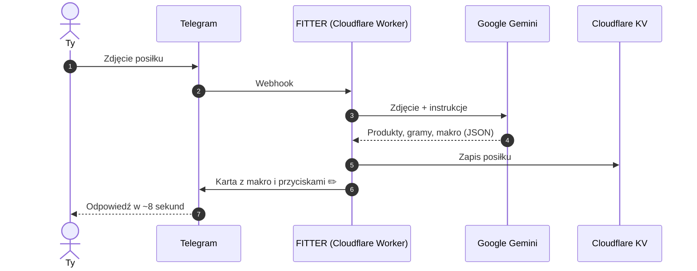

[Русский](README.md) · [English](README.en.md) · [Español](README.es.md) · [Português](README.pt.md) · [Deutsch](README.de.md) · [Français](README.fr.md) · [Italiano](README.it.md) · [Türkçe](README.tr.md) · [Українська](README.uk.md) · **Polski**

 

&nbsp;&nbsp;

<a href="#-funkcje">Funkcje</a> · <a href="#-jak-to-działa">Jak to działa</a> · <a href="#-zrzuty-ekranu">Zrzuty ekranu</a> · <a href="https://t.me/arkhitkovv">Kontakt</a>

> [!IMPORTANT]
> **FITTER szacuje kalorie w przybliżeniu.** Wynik ze zdjęcia zależy od składników i wielkości porcji, a każdy wpis można poprawić ręcznie. Bot nie zastępuje porady lekarza ani dietetyka.

> [!NOTE]
> Na razie bot mówi po rosyjsku. Ta strona to tłumaczenie [rosyjskiego README](README.md).

---

## 📸 Zrzuty ekranu

  

---

## ✨ Funkcje

<table>
  <tr>
    <td width="50%" valign="top">

      <h3>📷 Zapisywanie posiłków</h3>
      <ul>
        <li>Rozpoznawanie dania ze zdjęcia: produkty, gramy i makro na 100 g</li>
        <li>Podpis pod zdjęciem działa jak podpowiedź: „to 200 g ryżu”</li>
        <li>Zapis tekstem: „zjadłem 2 jajka i tost”</li>
        <li>Popraw nazwę lub gramy, a AI przeliczy makro</li>
        <li>Usuwanie wpisów jednym dotknięciem</li>
      </ul>
    
</td>
    <td width="50%" valign="top">

      <h3>🏷️ Produkty pakowane</h3>
      <ul>
        <li>Zdjęcie etykiety z wartościami odżywczymi: bot przepisuje je dokładnie</li>
        <li>Odczyt kodu kreskowego i wyszukiwanie w <a href="https://world.openfoodfacts.org">Open Food Facts</a></li>
        <li>Albo po prostu wyślij cyfry kodu kreskowego</li>
      </ul>
    
</td>
  </tr>
  <tr>
    <td width="50%" valign="top">

      <h3>🎯 Cele i postępy</h3>
      <ul>
        <li>Ankieta z 6 pytań i dzienne zapotrzebowanie według wzoru Mifflina–St Jeora</li>
        <li>Cele: schudnąć, utrzymać wagę albo zbudować masę</li>
        <li>Podsumowania dnia i tygodnia: zjedzone, zostało, gdzie był nadmiar</li>
        <li>Śledzenie wagi z wykresem i automatyczną aktualizacją zapotrzebowania</li>
      </ul>
    
</td>
    <td width="50%" valign="top">

      <h3>💧 Woda i tabletki</h3>
      <ul>
        <li>Cel wody: 30 ml na kg masy ciała, przyciski +250 i +500 ml</li>
        <li>Przypomnienia co 30 minut do co 2 godziny, w nocy cisza</li>
        <li>Witaminy i leki według pory przyjmowania</li>
        <li>Przyciski „Wzięte”, „Za 30 min” i „Pomiń”</li>
      </ul>
    
</td>
  </tr>
  <tr>
    <td width="50%" valign="top">

      <h3>🧠 Asystent AI</h3>
      <ul>
        <li>„Co zjeść”: 3 propozycje dopasowane do pozostałych kalorii i białka</li>
        <li>Każda propozycja trafia do dziennika jednym przyciskiem</li>
        <li>Tygodniowe podsumowanie z oceną, pochwałą i 3 radami</li>
        <li>Odpowiedzi na pytania o żywienie z uwzględnieniem twojego zapotrzebowania</li>
      </ul>
    
</td>
    <td width="50%" valign="top">

      <h3>🏆 Nawyki</h3>
      <ul>
        <li>Seria dni z rzędu, której nie zechcesz przerwać</li>
        <li>13 osiągnięć: serie, dni w normie, woda, etykiety, waga</li>
        <li>Świąteczne animacje, gdy osiągniesz cel</li>
      </ul>
    
</td>
  </tr>
  <tr>
    <td width="50%" valign="top">

      <h3>📱 Dziennik (Mini App)</h3>
      <ul>
        <li>Pierścień kalorii, kalendarz i wykres tygodnia, karty makro z podpowiedziami</li>
        <li>Szklanka wody z falą i przyciski ±250 ml</li>
        <li>Zapis jedzenia tekstem, także za minione dni</li>
        <li>Jasny i ciemny motyw</li>
      </ul>
    
</td>
    <td width="50%" valign="top">

      <h3>🎨 Wygląd i niezawodność</h3>
      <ul>
        <li>Własny zestaw ikon, <a href="icons/">FITTER Icons</a></li>
        <li>Automatyczne przejście na zapasowy model Gemini</li>
        <li>Limit czasu AI 24 sekundy: jasna odpowiedź zamiast niekończącego się ładowania</li>
        <li>Dzienny limit zapytań chroni darmowy przydział</li>
      </ul>
    
</td>
  </tr>
</table>

---

## 🤖 Polecenia

| Polecenie | Co robi |
|:---|:---|
| `/start` | Powitanie i ankieta |
| `/today` · `/week` | Podsumowanie dnia i ostatnich 7 dni |
| `/water` · `/remind` | Dzisiejsza woda i przypomnienia |
| `/advice` | Co zjeść: 3 propozycje od AI |
| `/pills` | Tabletki: oznaczanie, dodawanie, usuwanie |
| `/weight 72.5` | Zapis wagi |
| `/profile` | Profil i dzienne zapotrzebowanie |
| `/awards` · `/analysis` | Osiągnięcia i tygodniowe podsumowanie od AI |
| `/app` | Otwarcie dziennika |
| `/reset` · `/help` | Ponowna ankieta i pomoc |
| `/delete` | Usunięcie wszystkich twoich danych |

---

## 🧠 Jak to działa

| Warstwa | Technologia | Dlaczego |
|:---|:---|:---|
| Interfejs | Telegram Bot API + Mini App | Każdy ma już Telegrama, nic nie trzeba pobierać |
| Serwer | Cloudflare Workers | Za darmo, 24/7, bez własnych serwerów |
| AI | Google Gemini (Flash / Flash-Lite) | Rozumie zdjęcia, odpowiada ścisłym JSON-em |
| Baza danych | Cloudflare KV | Darmowa i wbudowana w Workers |
| Wdrożenie | GitHub → Cloudflare Builds | Każdy commit sam trafia na serwer |

Cały serwer to jeden plik, [`worker.js`](worker.js), bez zależności.

---

## 🔒 Bezpieczeństwo i prywatność

- Webhook przyjmuje tylko żądania z tajnym nagłówkiem Telegrama.
- Dziennik sprawdza kryptograficzny podpis Telegrama, więc nikt nie otworzy cudzych danych.
- Klucze są w sekretach Cloudflare, a nie w kodzie.
- Zdjęcia **nie są przechowywane**: trafiają do Gemini tylko do rozpoznania.

Więcej: [polityka prywatności](https://sailxx.github.io/FITTER-AI/privacy.html) (po rosyjsku).

---

## 🗺 Plan rozwoju

- [x] **v1** Bot na Cloudflare, ankieta, zapotrzebowanie, zapis ze zdjęcia, dziennik, waga, woda, etykiety i kody kreskowe
- [x] **v2** Asystent „Co zjeść”, tabletki z przypomnieniami, statystyki, jasny i ciemny motyw
- [x] **v2.6** Nowy wygląd dziennika, podpowiedzi do makro, wykres tygodnia; odświeżone woda i tabletki w bocie
- [ ] **v3.0** Produkt: osobna aplikacja

Pełna historia: [CHANGELOG.md](CHANGELOG.md) (po rosyjsku).

---

## ❓ Pytania i pomysły

Znalazłeś błąd albo masz pomysł? Otwórz [issue](https://github.com/sailxx/FITTER-AI/issues/new) lub napisz do autora na Telegramie: [@arkhitkovv](https://t.me/arkhitkovv).

---

## ⚖️ Licencja

FITTER jest udostępniany na licencji **MIT**, zobacz [LICENSE](LICENSE). To niezależny projekt, niezwiązany z Telegramem, Google ani Cloudflare. Wszystkie nazwy należą do ich właścicieli.

   
  
   
  <b>FITTER</b> · Jedno zdjęcie. Pełna kontrola.
   
  Stworzył <a href="https://t.me/arkhitkovv">Vlad</a>. Jeśli projekt ci pomógł, daj repozytorium ⭐

