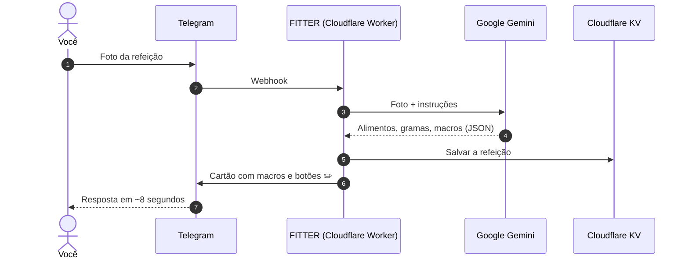

[Русский](README.md) · [English](README.en.md) · [Español](README.es.md) · **Português** · [Deutsch](README.de.md) · [Français](README.fr.md)

 

&nbsp;&nbsp;

<a href="#-recursos">Recursos</a> · <a href="#-como-funciona">Como funciona</a> · <a href="#-capturas-de-tela">Capturas</a> · <a href="https://t.me/arkhitkovv">Contato</a>

> [!IMPORTANT]
> **O FITTER estima as calorias de forma aproximada.** O resultado de uma foto depende dos ingredientes e do tamanho da porção, e qualquer registro pode ser corrigido à mão. O bot não substitui a orientação de um médico ou nutricionista.

> [!NOTE]
> Por enquanto o bot fala russo. Esta página é uma tradução do [README em russo](README.md).

---

## 📸 Capturas de tela

  

---

## ✨ Recursos

<table>
  <tr>
    <td width="50%" valign="top">

      <h3>📷 Registro de refeições</h3>
      <ul>
        <li>Reconhecimento de pratos por foto: alimentos, gramas e macros por 100 g</li>
        <li>A legenda da foto funciona como dica: “são 200 g de arroz”</li>
        <li>Registro por texto: “comi 2 ovos e uma torrada”</li>
        <li>Corrija o nome ou os gramas e a IA recalcula os macros</li>
        <li>Apague registros com um toque</li>
      </ul>
    
</td>
    <td width="50%" valign="top">

      <h3>🏷️ Embalagens</h3>
      <ul>
        <li>Foto do rótulo nutricional: o bot copia os valores exatamente</li>
        <li>Leitura do código de barras e busca no <a href="https://world.openfoodfacts.org">Open Food Facts</a></li>
        <li>Ou simplesmente envie os números do código</li>
      </ul>
    
</td>
  </tr>
  <tr>
    <td width="50%" valign="top">

      <h3>🎯 Metas e progresso</h3>
      <ul>
        <li>Questionário de 6 perguntas e meta diária pela fórmula de Mifflin–St Jeor</li>
        <li>Metas: emagrecer, manter o peso ou ganhar massa</li>
        <li>Resumo do dia e da semana: consumido, restante e excessos</li>
        <li>Registro de peso com gráfico e recálculo automático da meta</li>
      </ul>
    
</td>
    <td width="50%" valign="top">

      <h3>💧 Água e remédios</h3>
      <ul>
        <li>Meta de água de 30 ml por kg de peso, botões +250 e +500 ml</li>
        <li>Lembretes a cada 30 minutos a 2 horas, silêncio à noite</li>
        <li>Vitaminas e remédios por horário</li>
        <li>Botões “Tomei”, “Em 30 min” e “Pular”</li>
      </ul>
    
</td>
  </tr>
  <tr>
    <td width="50%" valign="top">

      <h3>🧠 Assistente com IA</h3>
      <ul>
        <li>“O que comer”: 3 opções de acordo com as calorias e proteínas restantes</li>
        <li>Qualquer opção vai para o diário com um botão</li>
        <li>Análise semanal com nota, elogios e 3 dicas</li>
        <li>Respostas sobre nutrição que consideram a sua meta</li>
      </ul>
    
</td>
    <td width="50%" valign="top">

      <h3>🏆 Hábitos</h3>
      <ul>
        <li>Uma sequência de dias que você não vai querer quebrar</li>
        <li>13 conquistas: sequências, dias na meta, água, rótulos, peso</li>
        <li>Animações de comemoração ao bater a meta</li>
      </ul>
    
</td>
  </tr>
  <tr>
    <td width="50%" valign="top">

      <h3>📱 Diário (Mini App)</h3>
      <ul>
        <li>Anel de calorias, calendário e gráfico da semana, cartões de macros com dicas</li>
        <li>Copo de água com onda e botões ±250 ml</li>
        <li>Registro por texto, inclusive de dias anteriores</li>
        <li>Tema claro e escuro</li>
      </ul>
    
</td>
    <td width="50%" valign="top">

      <h3>🎨 Design e confiabilidade</h3>
      <ul>
        <li>Conjunto de ícones próprio, <a href="icons/">FITTER Icons</a></li>
        <li>Troca automática para um modelo Gemini reserva</li>
        <li>Limite de 24 s para a IA: resposta clara em vez de carregamento infinito</li>
        <li>Um limite diário de pedidos protege a cota gratuita</li>
      </ul>
    
</td>
  </tr>
</table>

---

## 🤖 Comandos

| Comando | O que faz |
|:---|:---|
| `/start` | Apresentação e questionário |
| `/today` · `/week` | Resumo de hoje e dos últimos 7 dias |
| `/water` · `/remind` | Água de hoje e lembretes |
| `/advice` | O que comer: 3 sugestões da IA |
| `/pills` | Remédios: marcar, adicionar, apagar |
| `/weight 72.5` | Registrar o peso |
| `/profile` | Perfil e meta diária |
| `/awards` · `/analysis` | Conquistas e análise semanal com IA |
| `/app` | Abrir o diário |
| `/reset` · `/help` | Refazer o questionário e ajuda |
| `/delete` | Apagar todos os seus dados |

---

## 🧠 Como funciona

| Camada | Tecnologia | Por quê |
|:---|:---|:---|
| Interface | Telegram Bot API + Mini App | Todo mundo já tem Telegram, nada para baixar |
| Servidor | Cloudflare Workers | Grátis, 24/7, sem servidores para manter |
| IA | Google Gemini (Flash / Flash-Lite) | Entende fotos e responde em JSON estrito |
| Banco de dados | Cloudflare KV | Grátis e integrado ao Workers |
| Deploy | GitHub → Cloudflare Builds | Cada commit vai sozinho para o servidor |

O servidor inteiro é um único arquivo, [`worker.js`](worker.js), sem dependências.

---

## 🔒 Segurança e privacidade

- O webhook só aceita pedidos com o cabeçalho secreto do Telegram.
- O diário verifica a assinatura criptográfica do Telegram: ninguém abre os dados de outra pessoa.
- As chaves ficam nos secrets da Cloudflare, não no código.
- As fotos **não são guardadas**: vão para o Gemini apenas para o reconhecimento.

Mais detalhes: [política de privacidade](https://sailxx.github.io/FITTER-AI/privacy.html) (em russo).

---

## 🗺 Roteiro

- [x] **v1** Bot na Cloudflare, questionário, meta, registro por foto, diário, peso, água, rótulos e códigos de barras
- [x] **v2** Assistente “O que comer”, remédios com lembretes, estatísticas, tema claro e escuro
- [x] **v2.6** Novo visual do diário, dicas de macros, gráfico da semana; água e remédios renovados no bot
- [ ] **v3.0** Produto: app próprio

Histórico completo: [CHANGELOG.md](CHANGELOG.md) (em russo).

---

## ❓ Dúvidas e ideias

Achou um bug ou tem uma ideia? Abra uma [issue](https://github.com/sailxx/FITTER-AI/issues/new) ou escreva para o autor no Telegram: [@arkhitkovv](https://t.me/arkhitkovv).

---

## ⚖️ Licença

O FITTER é distribuído sob a licença **MIT**, veja [LICENSE](LICENSE). É um projeto independente e não tem relação com Telegram, Google ou Cloudflare. Os nomes pertencem aos seus donos.

   
  
   
  <b>FITTER</b> · Uma foto. Controle total.
   
  Feito por <a href="https://t.me/arkhitkovv">Vlad</a>. Se o projeto te ajudou, deixe uma ⭐ no repositório.

