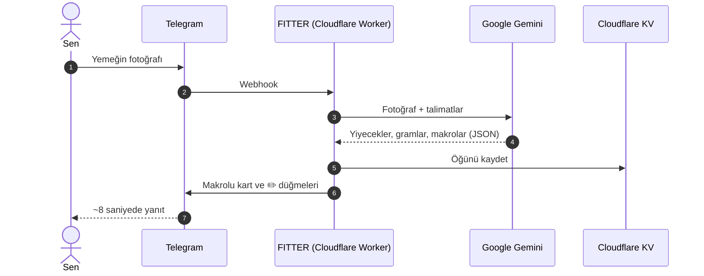

[Русский](README.md) · [English](README.en.md) · [Español](README.es.md) · [Português](README.pt.md) · [Deutsch](README.de.md) · [Français](README.fr.md) · [Italiano](README.it.md) · **Türkçe** · [Українська](README.uk.md) · [Polski](README.pl.md)

 

&nbsp;&nbsp;

<a href="#-özellikler">Özellikler</a> · <a href="#-nasıl-çalışır">Nasıl çalışır</a> · <a href="#-ekran-görüntüleri">Ekran görüntüleri</a> · <a href="https://t.me/arkhitkovv">İletişim</a>

> [!IMPORTANT]
> **FITTER kalorileri yaklaşık olarak hesaplar.** Fotoğraftan çıkan sonuç malzemelere ve porsiyon büyüklüğüne bağlıdır; her kayıt elle düzeltilebilir. Bot, bir doktorun veya diyetisyenin tavsiyesinin yerini tutmaz.

> [!NOTE]
> Bot şimdilik Rusça konuşuyor. Bu sayfa [Rusça README](README.md) dosyasının çevirisidir.

---

## 📸 Ekran görüntüleri

  

---

## ✨ Özellikler

<table>
  <tr>
    <td width="50%" valign="top">

      <h3>📷 Yemek kaydı</h3>
      <ul>
        <li>Fotoğraftan yemek tanıma: yiyecekler, gramlar ve 100 g başına makrolar</li>
        <li>Fotoğraf açıklaması ipucu olur: “bu 200 g pirinç”</li>
        <li>Metinle kayıt: “2 yumurta ve tost yedim”</li>
        <li>Adı veya gramı düzelt, YZ makroları yeniden hesaplar</li>
        <li>Kayıtları tek dokunuşla sil</li>
      </ul>
    
</td>
    <td width="50%" valign="top">

      <h3>🏷️ Paketli ürünler</h3>
      <ul>
        <li>Besin değeri etiketinin fotoğrafı: bot değerleri birebir aktarır</li>
        <li>Barkod okuma ve <a href="https://world.openfoodfacts.org">Open Food Facts</a> üzerinde arama</li>
        <li>Ya da sadece barkod rakamlarını gönder</li>
      </ul>
    
</td>
  </tr>
  <tr>
    <td width="50%" valign="top">

      <h3>🎯 Hedefler ve ilerleme</h3>
      <ul>
        <li>6 soruluk anket ve Mifflin–St Jeor formülüyle günlük hedef</li>
        <li>Hedefler: kilo vermek, kiloyu korumak veya kas kazanmak</li>
        <li>Günlük ve haftalık özetler: yenen, kalan, nerede aşıldığı</li>
        <li>Grafikli kilo takibi ve hedefin otomatik güncellenmesi</li>
      </ul>
    
</td>
    <td width="50%" valign="top">

      <h3>💧 Su ve ilaçlar</h3>
      <ul>
        <li>Kilogram başına 30 ml su hedefi, +250 ve +500 ml düğmeleri</li>
        <li>30 dakikadan 2 saate kadar hatırlatmalar, gece sessiz</li>
        <li>Alım saatine göre vitaminler ve ilaçlar</li>
        <li>“Alındı”, “30 dk sonra” ve “Atla” düğmeleri</li>
      </ul>
    
</td>
  </tr>
  <tr>
    <td width="50%" valign="top">

      <h3>🧠 YZ asistanı</h3>
      <ul>
        <li>“Ne yesem”: kalan kalori ve proteine uyan 3 seçenek</li>
        <li>Her seçenek tek düğmeyle günlüğe eklenir</li>
        <li>Puan, övgü ve 3 tavsiyeyle haftalık değerlendirme</li>
        <li>Hedefini dikkate alan beslenme sorularına yanıtlar</li>
      </ul>
    
</td>
    <td width="50%" valign="top">

      <h3>🏆 Alışkanlıklar</h3>
      <ul>
        <li>Bozmak istemeyeceğin bir günlük seri</li>
        <li>13 başarı: seriler, hedefte geçen günler, su, etiketler, kilo</li>
        <li>Hedefe ulaştığında kutlama animasyonları</li>
      </ul>
    
</td>
  </tr>
  <tr>
    <td width="50%" valign="top">

      <h3>📱 Günlük (Mini App)</h3>
      <ul>
        <li>Kalori halkası, hafta takvimi ve haftalık grafik, ipuçlu makro kartları</li>
        <li>Dalgalı su bardağı ve ±250 ml düğmeleri</li>
        <li>Geçmiş günler dahil metinle yemek kaydı</li>
        <li>Açık ve koyu tema</li>
      </ul>
    
</td>
    <td width="50%" valign="top">

      <h3>🎨 Tasarım ve güvenilirlik</h3>
      <ul>
        <li>Kendi simge seti, <a href="icons/">FITTER Icons</a></li>
        <li>Yedek Gemini modeline otomatik geçiş</li>
        <li>24 saniyelik YZ zaman aşımı: bitmeyen yükleme yerine net bir yanıt</li>
        <li>Günlük istek sınırı ücretsiz kotayı korur</li>
      </ul>
    
</td>
  </tr>
</table>

---

## 🤖 Komutlar

| Komut | Ne yapar |
|:---|:---|
| `/start` | Tanışma ve anket |
| `/today` · `/week` | Bugünün ve son 7 günün özeti |
| `/water` · `/remind` | Bugünkü su ve hatırlatmalar |
| `/advice` | Ne yesem: YZ'den 3 öneri |
| `/pills` | İlaçlar: işaretle, ekle, sil |
| `/weight 72.5` | Kiloyu kaydet |
| `/profile` | Profil ve günlük hedef |
| `/awards` · `/analysis` | Başarılar ve YZ'nin haftalık değerlendirmesi |
| `/app` | Günlüğü aç |
| `/reset` · `/help` | Anketi yeniden doldur ve yardım |
| `/delete` | Tüm verilerini sil |

---

## 🧠 Nasıl çalışır

| Katman | Teknoloji | Neden |
|:---|:---|:---|
| Arayüz | Telegram Bot API + Mini App | Herkeste Telegram zaten var, indirilecek bir şey yok |
| Sunucu | Cloudflare Workers | Ücretsiz, 7/24, yönetilecek sunucu yok |
| YZ | Google Gemini (Flash / Flash-Lite) | Fotoğrafları anlar, katı JSON ile yanıt verir |
| Veritabanı | Cloudflare KV | Ücretsiz ve Workers'a yerleşik |
| Dağıtım | GitHub → Cloudflare Builds | Her commit sunucuya kendiliğinden gider |

Sunucunun tamamı tek bir dosya: [`worker.js`](worker.js), sıfır bağımlılık.

---

## 🔒 Güvenlik ve gizlilik

- Webhook yalnızca Telegram'ın gizli başlığını taşıyan istekleri kabul eder.
- Günlük, Telegram'ın kriptografik imzasını doğrular; kimse başkasının verilerini açamaz.
- Anahtarlar kodda değil, Cloudflare secret'larında durur.
- Fotoğraflar **saklanmaz**: yalnızca tanıma için Gemini'ye gider.

Ayrıntılar: [gizlilik politikası](https://sailxx.github.io/FITTER-AI/privacy.html) (Rusça).

---

## 🗺 Yol haritası

- [x] **v1** Cloudflare'de bot, anket, hedef, fotoğrafla kayıt, günlük, kilo, su, etiketler ve barkodlar
- [x] **v2** “Ne yesem” asistanı, hatırlatmalı ilaçlar, istatistikler, açık ve koyu tema
- [x] **v2.6** Günlüğün yeni görünümü, makro ipuçları, haftalık grafik; botta yenilenen su ve ilaçlar
- [ ] **v3.0** Ürün: bağımsız uygulama

Tüm geçmiş: [CHANGELOG.md](CHANGELOG.md) (Rusça).

---

## ❓ Sorular ve fikirler

Bir hata mı buldun ya da bir fikrin mi var? Bir [issue](https://github.com/sailxx/FITTER-AI/issues/new) aç veya yazara Telegram'dan yaz: [@arkhitkovv](https://t.me/arkhitkovv).

---

## ⚖️ Lisans

FITTER **MIT** lisansıyla yayınlanır, bkz. [LICENSE](LICENSE). Bağımsız bir projedir; Telegram, Google veya Cloudflare ile bağlantısı yoktur. Tüm adlar sahiplerine aittir.

   
  
   
  <b>FITTER</b> · Tek fotoğraf. Tam kontrol.
   
  <a href="https://t.me/arkhitkovv">Vlad</a> tarafından yapıldı. Proje işine yaradıysa depoya bir ⭐ ver.

