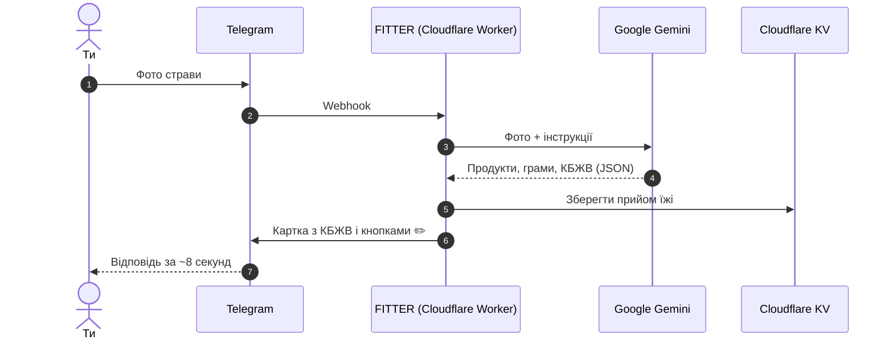

[Русский](README.md) · [English](README.en.md) · [Español](README.es.md) · [Português](README.pt.md) · [Deutsch](README.de.md) · [Français](README.fr.md) · [Italiano](README.it.md) · [Türkçe](README.tr.md) · **Українська** · [Polski](README.pl.md)

 

&nbsp;&nbsp;

<a href="#-можливості">Можливості</a> · <a href="#-як-це-працює">Як працює</a> · <a href="#-скриншоти">Скриншоти</a> · <a href="https://t.me/arkhitkovv">Зв’язок</a>

> [!IMPORTANT]
> **FITTER оцінює калорії приблизно.** Результат за фото залежить від складу й розміру порції, а будь-який запис можна виправити вручну. Бот не замінює консультацію лікаря чи дієтолога.

> [!NOTE]
> Поки що бот розмовляє російською. Ця сторінка — переклад [російського README](README.md).

---

## 📸 Скриншоти

  

---

## ✨ Можливості

<table>
  <tr>
    <td width="50%" valign="top">

      <h3>📷 Облік їжі</h3>
      <ul>
        <li>Розпізнавання страви за фото: продукти, грами й КБЖВ на 100 г</li>
        <li>Підпис до фото працює як підказка: «це 200 г рису»</li>
        <li>Запис текстом: «з’їв 2 яйця і тост»</li>
        <li>Зміни назву або грами — ШІ перерахує КБЖВ</li>
        <li>Видалення записів одним дотиком</li>
      </ul>
    
</td>
    <td width="50%" valign="top">

      <h3>🏷️ Продукти в упаковці</h3>
      <ul>
        <li>Фото етикетки зі складом: бот точно переносить значення</li>
        <li>Зчитування штрихкоду й пошук в <a href="https://world.openfoodfacts.org">Open Food Facts</a></li>
        <li>Або просто надішли цифри штрихкоду</li>
      </ul>
    
</td>
  </tr>
  <tr>
    <td width="50%" valign="top">

      <h3>🎯 Цілі та прогрес</h3>
      <ul>
        <li>Анкета з 6 питань і денна норма за формулою Міффліна — Сан-Жеора</li>
        <li>Цілі: схуднути, тримати вагу або набрати масу</li>
        <li>Підсумки дня й тижня: з’їдено, залишилось, де був перебір</li>
        <li>Облік ваги з графіком і автоматичним оновленням норми</li>
      </ul>
    
</td>
    <td width="50%" valign="top">

      <h3>💧 Вода й таблетки</h3>
      <ul>
        <li>Норма води 30 мл на кг ваги, кнопки +250 і +500 мл</li>
        <li>Нагадування кожні 30 хвилин — 2 години, вночі тиша</li>
        <li>Вітаміни й ліки за часом прийому</li>
        <li>Кнопки «Прийняв», «Через 30 хв» і «Пропустити»</li>
      </ul>
    
</td>
  </tr>
  <tr>
    <td width="50%" valign="top">

      <h3>🧠 ШІ-помічник</h3>
      <ul>
        <li>«Що з’їсти»: 3 варіанти під залишок калорій і білка</li>
        <li>Будь-який варіант додається в щоденник однією кнопкою</li>
        <li>Тижневий розбір з оцінкою, похвалою і 3 порадами</li>
        <li>Відповіді на питання про харчування з урахуванням твоєї норми</li>
      </ul>
    
</td>
    <td width="50%" valign="top">

      <h3>🏆 Звички</h3>
      <ul>
        <li>Серія днів поспіль, яку не хочеться переривати</li>
        <li>13 досягнень: серії, дні в нормі, вода, етикетки, вага</li>
        <li>Святкова анімація, коли досягаєш норми</li>
      </ul>
    
</td>
  </tr>
  <tr>
    <td width="50%" valign="top">

      <h3>📱 Щоденник (Mini App)</h3>
      <ul>
        <li>Кільце калорій, календар і графік тижня, картки БЖВ із підказками</li>
        <li>Склянка води з хвилею і кнопки ±250 мл</li>
        <li>Запис їжі текстом, зокрема за минулі дні</li>
        <li>Світла й темна тема</li>
      </ul>
    
</td>
    <td width="50%" valign="top">

      <h3>🎨 Дизайн і надійність</h3>
      <ul>
        <li>Власний набір іконок <a href="icons/">FITTER Icons</a></li>
        <li>Автоматичний перехід на резервну модель Gemini</li>
        <li>Тайм-аут ШІ 24 секунди: зрозуміла відповідь замість нескінченного завантаження</li>
        <li>Денний ліміт запитів захищає безкоштовну квоту</li>
      </ul>
    
</td>
  </tr>
</table>

---

## 🤖 Команди

| Команда | Що робить |
|:---|:---|
| `/start` | Знайомство й анкета |
| `/today` · `/week` | Підсумок за сьогодні й за останні 7 днів |
| `/water` · `/remind` | Вода за сьогодні й нагадування |
| `/advice` | Що з’їсти: 3 пропозиції від ШІ |
| `/pills` | Таблетки: відмітити, додати, видалити |
| `/weight 72.5` | Записати вагу |
| `/profile` | Профіль і денна норма |
| `/awards` · `/analysis` | Досягнення й тижневий розбір від ШІ |
| `/app` | Відкрити щоденник |
| `/reset` · `/help` | Пройти анкету заново й довідка |
| `/delete` | Видалити всі свої дані |

---

## 🧠 Як це працює

| Шар | Технологія | Навіщо |
|:---|:---|:---|
| Інтерфейс | Telegram Bot API + Mini App | Telegram уже є в усіх, нічого не треба завантажувати |
| Сервер | Cloudflare Workers | Безкоштовно, 24/7, без власних серверів |
| ШІ | Google Gemini (Flash / Flash-Lite) | Розуміє фото, відповідає строгим JSON |
| База даних | Cloudflare KV | Безкоштовна й вбудована в Workers |
| Деплой | GitHub → Cloudflare Builds | Кожен коміт сам потрапляє на сервер |

Увесь сервер — один файл [`worker.js`](worker.js) без залежностей.

---

## 🔒 Безпека та приватність

- Webhook приймає лише запити із секретним заголовком Telegram.
- Щоденник перевіряє криптографічний підпис Telegram, тож ніхто не відкриє чужі дані.
- Ключі зберігаються в секретах Cloudflare, а не в коді.
- Фото **не зберігаються**: вони потрапляють у Gemini лише для розпізнавання.

Докладніше: [політика конфіденційності](https://sailxx.github.io/FITTER-AI/privacy.html) (російською).

---

## 🗺 Дорожня карта

- [x] **v1** Бот на Cloudflare, анкета, норма, облік за фото, щоденник, вага, вода, етикетки й штрихкоди
- [x] **v2** Помічник «Що з’їсти», таблетки з нагадуваннями, аналітика, світла й темна тема
- [x] **v2.6** Новий вигляд щоденника, підказки до БЖВ, графік тижня; оновлені вода й таблетки в боті
- [ ] **v3.0** Продукт: окремий застосунок

Уся історія: [CHANGELOG.md](CHANGELOG.md) (російською).

---

## ❓ Питання та ідеї

Знайшли помилку або маєте ідею? Відкрийте [issue](https://github.com/sailxx/FITTER-AI/issues/new) або напишіть авторові в Telegram: [@arkhitkovv](https://t.me/arkhitkovv).

---

## ⚖️ Ліцензія

FITTER поширюється за ліцензією **MIT**, див. [LICENSE](LICENSE). Це незалежний проєкт, не пов’язаний із Telegram, Google чи Cloudflare. Усі назви належать їхнім власникам.

   
  
   
  <b>FITTER</b> · Одне фото. Повний контроль.
   
  Зробив <a href="https://t.me/arkhitkovv">Владислав</a>. Якщо проєкт вам допоміг, поставте репозиторію ⭐

